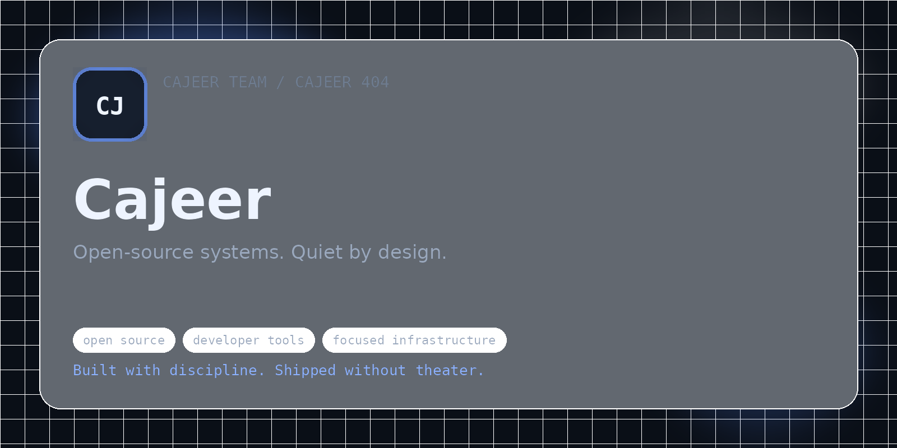

# Cajeer Docs

> **Open-source systems. Quiet by design.**

Welcome to the official documentation surface of **Cajeer Team & Cajeer 404**.

Cajeer builds open-source software, developer tools, and focused infrastructure around clarity, control, and long-term maintainability.  
Cajeer 404 is the public edge — releases, notes, experiments, and community signal around the work.

This documentation is intentionally restrained.

No filler. No ornamental marketing. No vague promises.  
Only what matters: structure, usage, boundaries, decisions, and release context.

## What you will find here

- product and project direction
- principles and operating posture
- platform and community structure
- brand and identity guidance
- GitBook setup notes for a consistent public surface

## Core signal

- **Primary:** Open-source systems. Quiet by design.
- **Secondary:** Built with discipline. Shipped without theater.

If it is documented here, it should remain readable and useful.
