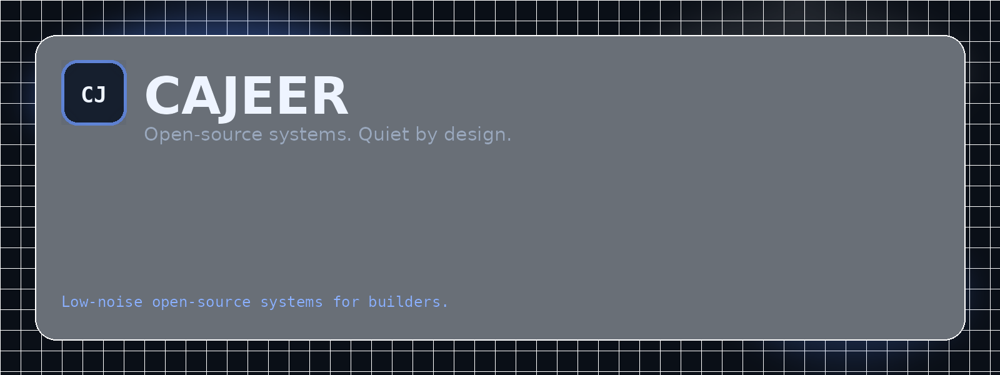

# Identity

This section defines the shared public system for **Cajeer Team & Cajeer 404**.

## Core signal

- **Primary:** Open-source systems. Quiet by design.
- **Secondary:** Built with discipline. Shipped without theater.
- **Position:** open-source software, developer tools, and focused infrastructure
- **Tone:** direct, calm, technical, unsentimental

## What should stay aligned everywhere

1. Dark background with one cold blue accent.
2. Short headlines, explicit nouns, minimal decorative noise.
3. The same structural split: **Cajeer Team** as the official contour, **Cajeer 404** as the public edge.
4. The same platform order in visible link groups: **GitHub → Docs → Telegram → Discord**.

## Assets

- `assets/cajeer-avatar.png` — square avatar for GitBook, Telegram, Discord
- `assets/cajeer-cover.png` — wide cover for README and docs
- `assets/cajeer-community-banner.png` — banner for Telegram, Discord, and announcements
- `assets/cajeer-mark-dark.png` — dark-mode wordmark
- `assets/cajeer-mark-light.png` — light-mode wordmark

## Next

- [Brand system](brand-system.md)
- [Platform copy](platform-copy.md)
- [GitBook setup](gitbook-setup.md)
